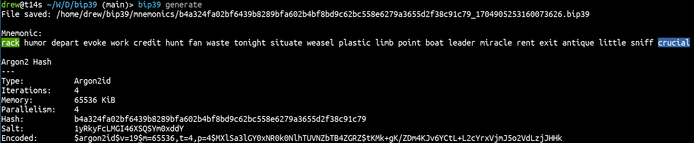

                   

## CLI for generation and verification of mnemonics in BIP39 with hash in Argon2id

### Build
    go build cmd/cli/bip39.go

### Install
    sudo install -t /usr/local/bin bip39

### BIP39 mnemonic generation
    bip39 generate

    --words value   Word count (default: 24)
    --color value   First and last word color highlighting (default: green,blue)
                    Allowed colors: black, red, green, yellow, blue, magenta, cyan, white
    --save value    Save to file [yes/no] (default: yes)
                    File name format: <Argon2idHash>_<TimestampUnixNano>.bip39
    --dir value     Save file to directory (default: ~/bip39/mnemonics)

### Check existing BIP39 mnemonic
    bip39 existing

    --color value   First and last word color highlighting (default: green,blue)
                    Allowed colors: black, red, green, yellow, blue, magenta, cyan, white
    --save value    Save to file [yes/no] (default: no)
                    File name format: <Argon2idHash>_<TimestampUnixNano>.bip39
    --dir value     Save file to directory (default: ~/bip39/mnemonics)

### Thanks
Thanks to Tyler Smith for providing the implementation of [BIP39](https://github.com/bitcoin/bips/blob/master/bip-0039.mediawiki) in [Golang](https://github.com/tyler-smith/go-bip39) that allowed us to create this tool!

### License
This BIP39 tool is released under the terms of the MIT license.  
See LICENSE for more information or see https://opensource.org/licenses/MIT.